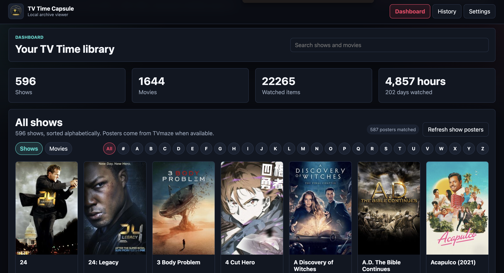
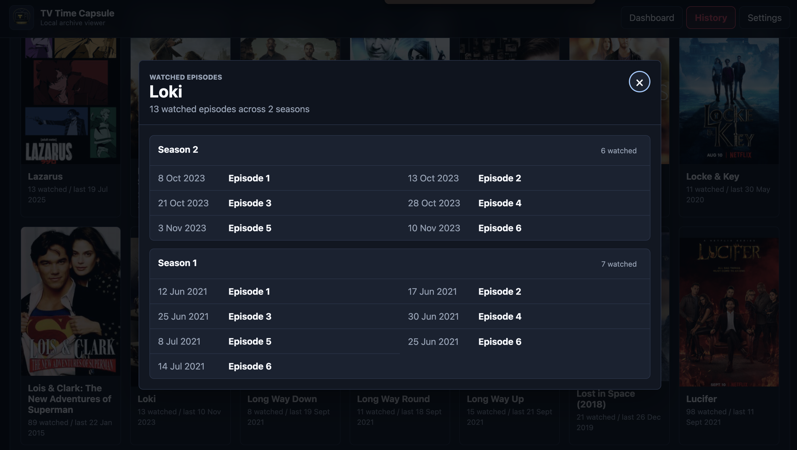

# TV Time Capsule

TV Time Capsule is a private, no-install viewer for TV Time GDPR exports.

Open the app in your browser, choose your TV Time GDPR ZIP, and browse your
shows, movies, watch history, posters, watch-later items, and aggregate stats
locally. The app does not upload your TV Time export.

## Screenshots

### Dashboard



### History



## Back Up Your TV Time Data First

Before trying any replacement app or migration path, export your TV Time data.
Request it as early as possible because exports can take time when the service is
busy.

TV Time Capsule is built for the official TV Time GDPR ZIP export. Start here:

[https://gdpr.tvtime.com/gdpr/self-service](https://gdpr.tvtime.com/gdpr/self-service)

1. Open the TV Time GDPR Data Export page.
2. Sign in with your TV Time email and password.
3. If you do not know your password, use the reset-password option on that page.
4. Request your personal data export.
5. Wait for TV Time to prepare the export.
6. Download the GDPR ZIP file when it is available.
7. Keep the ZIP file somewhere safe.

Do not unzip or edit the export before using TV Time Capsule. The app expects the
original `.zip` file.

## Alternative Export Options

If the official GDPR export is slow or unavailable, browser-based exporters may
help you save an extra copy of your TV Time data. These are useful backups, but
TV Time Capsule currently imports the official GDPR ZIP format.

- [TV Time Data Extractor](https://chromewebstore.google.com/detail/tv-time-data-extractor/jmpoblamjmpbhnggdihhcoejomkpkgpp)
  creates a simple CSV export locally in your browser.
- [TV Time Out by Refract](https://chromewebstore.google.com/detail/tv-time-out-by-refract/pmejpdpjbkjklfceogdkolmgclldogbi?hl=en)
  creates export files and an HTML archive of your profile. For smaller accounts,
  that HTML archive can make manual migration easier.

Use these as additional backups, not as a replacement for requesting the official
GDPR export.

## Use TV Time Capsule

1. Download this repository as a ZIP.
2. Unzip the repository.
3. Open `TVTimeCapsule.html` in your browser.
4. Choose your TV Time GDPR ZIP file.
5. Wait for the import to finish.
6. Use the Dashboard, History, Stats, and Settings views.

After import, TV Time Capsule saves a cleaned local library in your browser. The
next time you open `TVTimeCapsule.html`, it should open automatically.

If your browser storage is cleared, or the app asks for a reimport after an
update, choose the original TV Time GDPR ZIP again.

## What You Can Browse

- TV shows and movies from your export
- watched episodes and watched movies
- watch-later items where TV Time included them
- show/movie posters where metadata providers have a match
- aggregate Stats panels for watch time, weekly activity, ratings, comments,
  likes, badges, genres, networks/platforms, and catch-up estimates
- history grouped by show/movie and date range
- watched show episodes grouped by season
- comments and reaction memories where TV Time included them in the export

## Update Warning: Comments and Reactions

TV Time Capsule now imports safe comment and reaction files from the official
GDPR ZIP when they are present. These memories stay local in your browser and
are shown from the History view, not from the Dashboard library grid.

Comments may include spoilers, old personal notes, or community text that TV
Time included in your export. Reactions are mapped from TV Time reaction IDs
where known, and unknown reaction IDs are shown plainly instead of guessed.

This improves browsing your archive, but it is not a full community migration:
likes, discussion context, GIFs, translations, and complete social threads may
still be missing or incomplete depending on what TV Time exported.

## Update Warning: Stats Data

The Stats view imports additional safe GDPR files when present, including
ratings, character votes, badge records, cached stats, and timeframe count files.
Because this changes the cleaned local archive shape, older browser-saved
libraries must be rebuilt by importing the original GDPR ZIP again.

Stats now separates account history from watch-time duration. The Tracking
timeline shows when the account/export data begins, plus the first and last
detailed watch logs found in the GDPR export. Watch-time cards show hours and
days watched, not calendar months.

When TV Time includes all-time aggregate runtime totals, TV Time Capsule prefers
those values over summing detailed rows. This keeps Dashboard and Stats aligned
and avoids under-counting exports where older viewing activity exists only as
aggregate totals.

Stats panels label their source quality. Core totals come from the GDPR export.
Genres, networks/platforms, remaining episodes, and future watch-time estimates
depend on cached or refreshed TVmaze, Cinemeta/Stremio, iTunes, or optional TMDb
metadata. Social comparison is not included because the GDPR export does not
contain followed-user aggregate stats.

Badge tiles are simplified because TV Time badge artwork is not part of the GDPR
export. Duplicate badge IDs are grouped, raw badge codes are hidden from the
visible UI, and generic local badge icons are shown instead.

## What You Cannot Fully Migrate

Some TV Time memories may not be portable into another app, depending on what TV
Time includes in the export and what other apps support importing.

Community and social data is especially limited:

- GIF reactions
- episode discussions
- likes
- community interactions

TV Time Capsule focuses on preserving the private viewing library and watch
history that can be safely parsed from your export.

## What Stays Private

The app runs in your browser. Your GDPR ZIP is not uploaded by this app.

The generated local library intentionally excludes sensitive files such as:

- access and refresh tokens
- login/auth data and password hashes
- IP address history
- device tokens and device identifiers
- ad identifiers
- user agent and session records
- Facebook/social identity exports

The app shows a skipped-file report after import.

## Metadata and Images

TV Time exports do not include poster images or complete provider catalogues. TV
Time Capsule uses TVmaze to look up show posters and show metadata, and
Cinemeta/Stremio to look up movie posters when an internet connection is
available.

The Dashboard includes poster refresh buttons for retrying missing images. Movie
poster refreshes run in small batches and continue through the current filter.
The Stats view has a separate metadata refresh action for filling enhanced
analytics such as show networks, episode counts, genres, and remaining watch
time. Those lookups are cached in the browser-local archive.

For better fallback coverage, Settings supports an optional free TMDb API key.
When a show has no TVmaze poster, or when movie posters need a stronger source,
TV Time Capsule can try TMDb as a backup image source.

Metadata/image attribution:

- show metadata, images, network names, and episode counts can come from
  [TVmaze](https://www.tvmaze.com/)
- movie posters can come from Cinemeta/Stremio
- optional fallback images and genre metadata can come from
  [TMDb](https://www.themoviedb.org/)

## Local Browser Data

TV Time Capsule uses browser storage so non-technical users do not need to manage
extra archive files.

Keep your original TV Time GDPR ZIP backed up. It is the source file used to
rebuild the local library if browser storage is cleared or the app changes its
import format.

## Development

This is a static browser app. There is no build step for users.

Project structure:

```text
TVTimeCapsule.html
app/
  assets/
  css/
  js/
  vendor/
```

Vendored browser libraries:

- JSZip for reading GDPR ZIP files
- PapaParse for parsing CSV files

## Current Limitations

- Poster image binaries are not embedded in the local library. The app stores
  safe metadata and image URLs.
- Full unwatched episode lists require provider metadata and are not complete in
  v1. Stats estimates remaining episodes only when provider episode counts are
  available.
- If metadata providers are offline or cannot match a title, the app shows a
  clean placeholder.
- Stats badge tiles are local stylized labels based on imported badge IDs, not
  official TV Time artwork.
